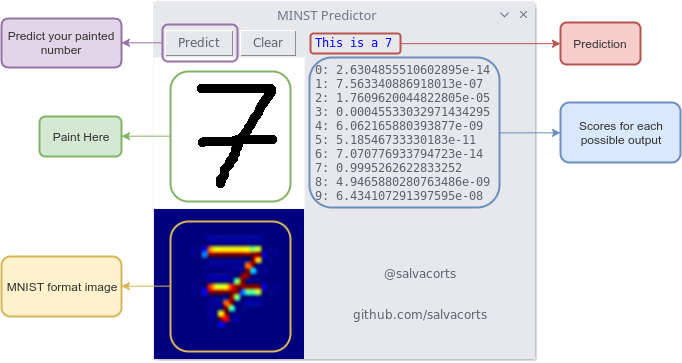

# Interactive MNIST Paint GUI

This is a PoC of using Keras to build, train, save and put in into productiona model.
I'm just beginning with Machine Learning so probably this is not the best model.

The interface offers a canvas square to draw numbers in and gives the predicted number within the scores for the rest of numbers.

## Requirements installation
- Pyhton 3
- Tkinter: `sudo apt install python3-tk`
- Tensorflows: https://www.tensorflow.org/install/install_linux
- Keras, Matploitlib, numpy: `pip3 install -r requirements.txt`

## Running
Clone this repository and move there:
`git clone https://github.com/salvacorts/Keras-MNIST-Paint.git && cd Keras-MNIST-Paint`

Run the program:
`chmod +x main.py && ./main.py`

## Hacking
Although this project comes with a pre-trained model, modifying and running [modules/train.py](https://github.com/salvacorts/Keras-MNIST-Paint/blob/master/modules/train.py) you can train your own model and tweak this Neural Network.
